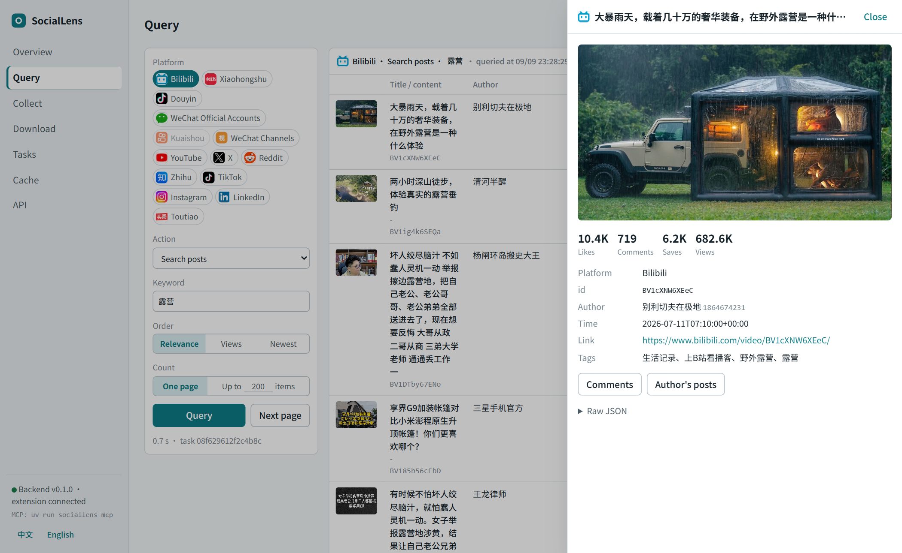
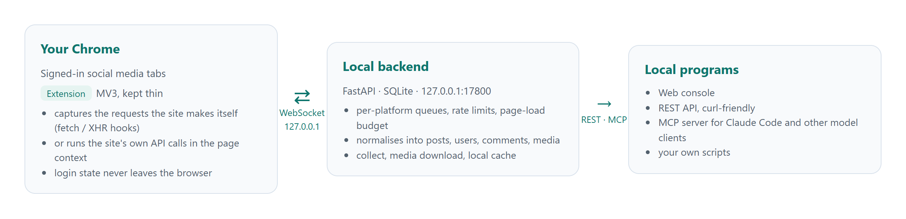
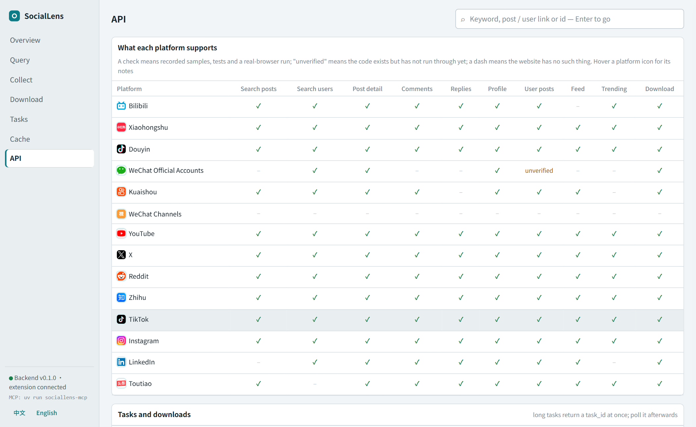

<div align="center">

            

# SocialLens

**Turn the social media accounts you are already signed in to in your browser into a local API.**

[中文](README.md) | English

     

</div>

A Chrome extension intercepts and executes each site's own requests inside your signed-in tabs and hands the data to a local FastAPI backend. The backend serves a unified REST API, an MCP server and a web console on `127.0.0.1:17800`. No platform API keys, and the backend never touches your credentials.



> For personal use only: your own accounts, the content you can already see. The project does no captcha solving, no risk-control evasion and no login automation. When a site shows a captcha, the task fails and the queue pauses until you handle it yourself.

## How it works



- **The extension stays thin.** It only intercepts and executes. Parsing, normalisation, storage and the public API all live in the backend.
- **Two strategies.** `call` runs the site's API inside the tab (Bilibili, Reddit and other sites whose requests are unsigned or reproducible). `navigate` opens a page and only captures what the site requests by itself (Xiaohongshu, Douyin, Instagram and other sites with non-reproducible signatures); paging scrolls or clicks in the same tab.
- **One data model.** Everything becomes `SocialPost`, `SocialUser`, `SocialComment`, `MediaItem`. Fields a platform lacks are null; the platform's own fields stay in `raw`.
- **Per-platform rate limits.** One queue per platform with a jittered interval plus a "no more than N fresh page loads per 10 minutes" budget. Over budget, tasks wait in the queue instead of failing.
- **Your tabs are left alone.** Pages the extension opens live in a separate work window, at most three per platform, reclaimed after five idle minutes. Your own tabs are read but never closed. The work window stays open once created (a small note page keeps it alive), so later tasks only add tabs and never pop it up again; shrink it or move it to another screen, the position is remembered. Don't minimize it or cover it completely: some platforms page only while the page is visible.

## What each platform supports

| Platform | Search posts | Search users | Post | Comments | Replies | Profile | User posts | Feed | Trending | Download |
|---|:-:|:-:|:-:|:-:|:-:|:-:|:-:|:-:|:-:|:-:|
|  Bilibili | ✓ | ✓ | ✓ | ✓ | ✓ | ✓ | ✓ | – | ✓ | ✓ |
|  Xiaohongshu | ✓ | ✓ | ✓ | ✓ | ✓ | ✓ | ✓ | ✓ | ✓ | ✓ |
|  Douyin | ✓ | ✓ | ✓ | ✓ | ✓ | ✓ | ✓ | ✓ | ✓ | ✓ |
|  Kuaishou | ✓ | ✓ | ✓ | ✓ | – | ✓ | ✓ | ✓ | – | ✓ |
|  WeChat Official Accounts | – | ✓ | ✓ | – | – | ✓ | unverified | – | – | ✓ |
|  WeChat Channels | – | – | – | – | – | – | – | – | – | – |
|  YouTube | ✓ | ✓ | ✓ | ✓ | ✓ | ✓ | ✓ | ✓ | ✓ | ✓ |
|  X | ✓ | ✓ | ✓ | ✓ | ✓ | ✓ | ✓ | ✓ | ✓ | ✓ |
|  Reddit | ✓ | ✓ | ✓ | ✓ | ✓ | ✓ | ✓ | ✓ | ✓ | ✓ |
|  Zhihu | ✓ | ✓ | ✓ | ✓ | ✓ | ✓ | ✓ | ✓ | ✓ | ✓ |
|  TikTok | ✓ | ✓ | ✓ | ✓ | ✓ | ✓ | ✓ | ✓ | ✓ | ✓ |
|  Instagram | ✓ | ✓ | ✓ | ✓ | ✓ | ✓ | ✓ | ✓ | ✓ | ✓ |
|  LinkedIn | – | ✓ | ✓ | ✓ | ✓ | ✓ | ✓ | ✓ | – | unverified |
|  Toutiao | ✓ | – | ✓ | ✓ | ✓ | ✓ | ✓ | ✓ | ✓ | ✓ |

A check means a real-browser run with recorded samples and parser tests. A dash means the website has no entry point for it, or the old endpoint is gone. Endpoint mappings, paging mechanics and known pitfalls for every platform are in [docs/platforms/](docs/platforms/).

Platform notes:

- **WeChat Channels** only has a creator backstage and share-link players on the web, no public entry points, so only a skeleton is registered.
- **WeChat Official Accounts** search and article lists go through the Official Accounts backstage, which requires signing in to your own account at mp.weixin.qq.com (a personal subscription account is enough). The article-list endpoint is easily frozen by the backstage.
- **LinkedIn**'s new web app is server-driven UI. Feed, post detail, profile and people search call the classic voyager API inside the tab; member posts, comments and replies are captured from the classic pages that still exist. Content search and trending have no usable endpoint.
- **YouTube, Reddit, TikTok and Toutiao** work signed out for public content.
- **YouTube and TikTok** downloads go through yt-dlp (optional dependency); the backend downloads everything else directly.

## Quick start

You need Python 3.12 + [uv](https://docs.astral.sh/uv/), Node 20+ + pnpm, and Chrome. Downloads also want ffmpeg on the PATH.

```bash
# 1. backend
cd backend
uv sync --extra dev            # add --extra download for yt-dlp (YouTube / TikTok downloads)
uv run sociallens              # listens on 127.0.0.1:17800

# 2. extension
cd ../extension
pnpm install
pnpm build                     # output in extension/dist; pnpm watch while developing
```

3. Open `chrome://extensions`, enable developer mode, "Load unpacked" and pick `extension/dist`.
4. The extension connects to the backend by itself. A green dot in the extension popup means it worked; nothing to configure.
5. Open http://127.0.0.1:17800/ for the console, or call the API directly:

```bash
curl http://127.0.0.1:17800/api/v1/status
curl "http://127.0.0.1:17800/api/v1/bilibili/search?keyword=camping"
```

Sign in to a platform in Chrome before querying it. `GET /api/v1/status` lists every platform's login state and login url; platforms you are not signed in to show a "Sign in" link in the popup.

The backend recognises the extension by the fixed extension id from the `key` field in `extension/manifest.json` (through the WebSocket Origin header, which page scripts cannot forge), hence zero configuration. If you change the manifest and the id changes, set `SOCIALLENS_EXTRA_EXTENSION_IDS=<new id>` or paste the content of `data/token` into the popup's advanced settings.

## Console

Open http://127.0.0.1:17800/ once the backend runs. A single static page, no build step, dark mode follows the system. The language follows the browser and can be switched at the bottom of the sidebar (Chinese / English).

- **Overview**: one tile per platform with login state, queue state and the page-load budget; a banner with a one-click resume when risk control paused a queue; recent tasks and download progress.
- **Query**: pick a platform, an action and parameters, in "one page" or "up to N items" mode. Results switch columns for posts, users, comments and topics; comments render as threads with inline reply loading; a row opens a detail drawer (metrics, media, quoted posts and link cards, raw JSON). Paging, JSON / CSV export. Results are kept per platform, and the top input resolves pasted links, ids or keywords.
- **Collect, Downloads, Tasks, Cache**: task lists with progress and cancel; everything queried is stored in local SQLite and can be browsed and exported by platform.
- **API**: the capability matrix (hover a platform icon for its notes), the REST list generated from OpenAPI with curl examples (GET endpoints can be tried in place), and the MCP tool list with the connect command.



## REST API

Every response is `{"success": true, "data": ...}` or `{"success": false, "error": {"code", "message"}}`. List endpoints return `data.items`, `data.total` and a top-level `cursor`; send the cursor back as is for the next page (a cursor is bound to a session tab and stays valid for ten minutes).

| Method | Path | Purpose |
|---|---|---|
| GET | `/api/v1/status` | extension online?, per-platform login state, queues and budgets |
| GET | `/api/v1/platforms` | registered platforms and their capabilities |
| GET | `/api/v1/resolve?q=` | which platform and object a link / id points to |
| GET | `/api/v1/{platform}/search?keyword=&type=post\|user&cursor=` | search |
| GET | `/api/v1/{platform}/posts/{id}` | post detail |
| GET | `/api/v1/{platform}/posts/{id}/comments?cursor=` | comments |
| GET | `/api/v1/{platform}/posts/{id}/comments/{comment_id}/replies?cursor=` | replies under one comment |
| GET | `/api/v1/{platform}/users/{id}` | profile |
| GET | `/api/v1/{platform}/users/{id}/posts?cursor=` | a user's posts |
| GET | `/api/v1/{platform}/feed?cursor=` | recommendation feed / home timeline |
| GET | `/api/v1/{platform}/trending` | trending (`kind=posts` or `kind=topics`) |
| POST | `/api/v1/{platform}/collect` | collect: page in the background up to `limit` items, deduplicated |
| POST | `/api/v1/{platform}/posts/{id}/download` | download a post's media into `data/downloads/` |
| GET | `/api/v1/tasks/{id}` | task state, result, progress |
| POST | `/api/v1/{platform}/resume` | clear a pause caused by risk control |
| GET | `/api/v1/items?kind=&platform=` | browse the local cache |

```bash
# collect 300 search results and wait for completion
curl -X POST http://127.0.0.1:17800/api/v1/bilibili/collect -H "content-type: application/json" \
  -d '{"action": "search_posts", "params": {"keyword": "camping"}, "limit": 300, "wait": true}'

# download one video
curl -X POST http://127.0.0.1:17800/api/v1/douyin/posts/7663480658576264457/download -H "content-type: application/json" -d '{"wait": true}'
```

Full parameters and each platform's id formats are on the console's API page and at http://127.0.0.1:17800/docs .

## MCP

`backend/sociallens/mcp/` is a thin shell over REST: stdio transport, every tool is one HTTP call to the local backend. Start the backend first, then let the MCP client launch it:

```bash
# Claude Code
claude mcp add sociallens -- uv run --project /path/to/SocialLens/backend sociallens-mcp
```

```json
{
  "mcpServers": {
    "sociallens": {
      "command": "uv",
      "args": ["run", "--project", "/path/to/SocialLens/backend", "sociallens-mcp"],
      "env": { "SOCIALLENS_URL": "http://127.0.0.1:17800" }
    }
  }
}
```

Tools: `status`, `list_platforms`, `get_capabilities`, `search`, `get_post`, `get_comments`, `get_replies`, `get_user`, `get_user_posts`, `get_feed`, `get_trending`, `collect`, `download`, `list_downloads`, `get_task`, `resume`. Backend errors (`not_logged_in`, `captcha_required`, `cursor_expired`, …) are passed through as tool errors.

## Downloads and proxies

Files land in `data/downloads/{platform}/{author id}/{post id}_{index}.{ext}`. Bilibili takes the best DASH quality and merges audio and video when ffmpeg is available; Reddit's separate audio track is merged; Toutiao takes the best quality only; YouTube and TikTok go through yt-dlp.

Downloads and yt-dlp follow the system proxy by default (`HTTPS_PROXY`, otherwise the Windows / macOS proxy settings), so they use the same route as the browser. `SOCIALLENS_DOWNLOAD_PROXY=off` disables it; a proxy url overrides it.

## Boundaries

- The backend never touches platform credentials; login state lives only in the browser. The backend binds to 127.0.0.1 only.
- No captcha solving, no risk-control evasion, no login automation.
- Ordinary browsing is not recorded; the interception layer only handles traffic triggered by API tasks.
- Pages the extension opens live in a separate work window; the user's own tabs are never closed.

## Development

```bash
cd backend && uv run pytest                    # backend tests; a fake extension speaks the real WebSocket protocol
cd extension && pnpm typecheck                 # extension type check

# real-browser end to end (backend running, extension built; install Playwright's Chromium once)
cd backend && uv run python -m playwright install chromium
cd .. && uv run --project backend python scripts/e2e_chrome.py
```

Parser tests use recorded samples in `backend/tests/fixtures/{platform}/`. They are recorded with real accounts and contain account data, so they are not in the repository; tests skip when a sample is missing. `POST /api/v1/{platform}/run` with `"raw": true` returns any action's raw response, and `scripts/sample_*.py` record samples.

Adding a platform: copy `docs/platforms/_template.md` and fill in the capability list; write the extension side in `platforms/{platform}/` (URL matching, login detection) and `page/platforms/{platform}.ts` (page actions returning raw JSON); write the backend adapter in `platforms/{platform}/` (capabilities, rate limit, entry URLs) and parsers (pure functions into the unified model); add the host permission to `manifest.json`. Generic page actions for exploration: `echo`, `fetch`, `wait_capture`, `scroll_capture`, `dom_probe`, `list_captures`, `find_scripts`, `read_element`, `click`, `type`.

Restart `uv run sociallens` after backend changes; rebuild with `pnpm build` and reload the extension at `chrome://extensions` after extension changes.

## Docker (backend only)

```bash
docker build -t sociallens-backend backend
docker run --rm -p 127.0.0.1:17800:17800 -v "$PWD/data:/data" sociallens-backend
```

The browser and the extension stay on the host; as long as the port is published on 127.0.0.1 the extension connects to the container by itself. The image ships ffmpeg and yt-dlp. The container cannot see the host's system proxy; pass it with `-e HTTPS_PROXY=http://host.docker.internal:7897` if needed.

## Layout

```
backend/   FastAPI backend: api/ ws/ tasks/ collect/ download/ platforms/ mcp/ models/ storage/ ui/
extension/ MV3 extension: background/ (WS client, tab routing) content/ (bridge) page/ (hooks and page actions) platforms/ popup/ work/
docs/      per-platform endpoint notes, README images
scripts/   end-to-end test and sampling scripts
data/      runtime files: token, SQLite, recorded samples, downloads, logs (not committed)
```
