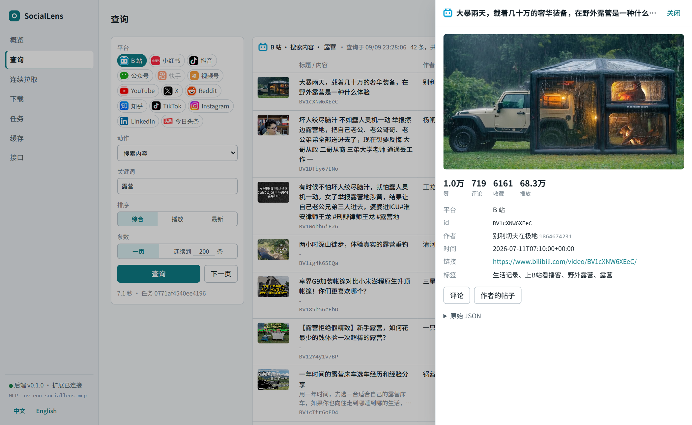
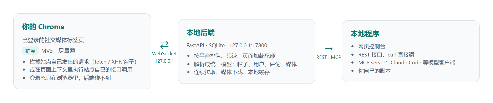
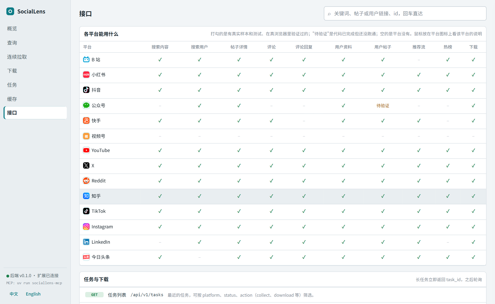

<div align="center">

            

# SocialLens

**把你浏览器里已经登录的社交媒体账号，变成一个本地 API。**

中文 | [English](README.en.md)

     

</div>

Chrome 扩展在你已登录的标签页里拦截和执行站点自己的请求，把数据交给本地 FastAPI 后端；后端在 `127.0.0.1:17800` 上提供统一的 REST 接口、MCP server 和一个网页控制台。不需要任何平台的 API key，后端也永远碰不到你的账号凭证。



> 仅供个人使用：用你自己的账号，看你自己能看到的内容。项目不做验证码识别、风控绕过和登录自动化；遇到验证码只报错并暂停队列，等你手动处理。

## 它是怎么工作的



- **扩展尽量薄**：只做拦截和执行两件事。解析、归一化、存储、对外接口全在后端。
- **两种取数策略**：`call` 是在标签页里直接调站点接口（B 站、Reddit 这类接口不签名或签名可复现的平台）；`navigate` 是打开站点页面、只捕获站点自己发出的请求（小红书、抖音、Instagram 这类接口带不可复现签名的平台），翻页靠在同一个标签页里滚动或点击。
- **统一数据模型**：所有平台都归一化成 `SocialPost`、`SocialUser`、`SocialComment`、`MediaItem`，平台没有的字段填 null，原始字段放在 `raw` 里。
- **按平台限速**：每个平台一条队列，派发间隔加抖动，另有"10 分钟内最多新开 N 个页面"的配额，超出就在队列里等，不报错。
- **不动你的标签页**：扩展自己开的页面都放在一个独立的工作窗口里，每平台最多 3 个会话页，闲置 5 分钟回收；你自己打开的页面只读不关。工作窗口第一次出现后会常驻（留一个说明页），后续任务只往里加标签页、不会再弹到前面；把它缩小或挪到副屏即可，位置会记住。不要最小化或完全遮住它，有些平台靠页面可见才能滚动翻页。

## 各平台能做什么

| 平台 | 搜索内容 | 搜索用户 | 帖子详情 | 评论 | 评论回复 | 用户资料 | 用户帖子 | 推荐流 | 热榜 | 下载 |
|---|:-:|:-:|:-:|:-:|:-:|:-:|:-:|:-:|:-:|:-:|
|  B 站 | ✓ | ✓ | ✓ | ✓ | ✓ | ✓ | ✓ | – | ✓ | ✓ |
|  小红书 | ✓ | ✓ | ✓ | ✓ | ✓ | ✓ | ✓ | ✓ | ✓ | ✓ |
|  抖音 | ✓ | ✓ | ✓ | ✓ | ✓ | ✓ | ✓ | ✓ | ✓ | ✓ |
|  快手 | ✓ | ✓ | ✓ | ✓ | – | ✓ | ✓ | ✓ | – | ✓ |
|  公众号 | – | ✓ | ✓ | – | – | ✓ | 待验证 | – | – | ✓ |
|  视频号 | – | – | – | – | – | – | – | – | – | – |
|  YouTube | ✓ | ✓ | ✓ | ✓ | ✓ | ✓ | ✓ | ✓ | ✓ | ✓ |
|  X | ✓ | ✓ | ✓ | ✓ | ✓ | ✓ | ✓ | ✓ | ✓ | ✓ |
|  Reddit | ✓ | ✓ | ✓ | ✓ | ✓ | ✓ | ✓ | ✓ | ✓ | ✓ |
|  知乎 | ✓ | ✓ | ✓ | ✓ | ✓ | ✓ | ✓ | ✓ | ✓ | ✓ |
|  TikTok | ✓ | ✓ | ✓ | ✓ | ✓ | ✓ | ✓ | ✓ | ✓ | ✓ |
|  Instagram | ✓ | ✓ | ✓ | ✓ | ✓ | ✓ | ✓ | ✓ | ✓ | ✓ |
|  LinkedIn | – | ✓ | ✓ | ✓ | ✓ | ✓ | ✓ | ✓ | – | 未验证 |
|  今日头条 | ✓ | – | ✓ | ✓ | ✓ | ✓ | ✓ | ✓ | ✓ | ✓ |

打勾的都经过真实浏览器验证并有 parser 测试。空的是平台网页端没有对应入口，或老接口已下线。每个平台的接口映射、翻页方式、已知坑都记在 [docs/platforms/](docs/platforms/) 里。

几个平台的特别说明：

- **视频号** 网页端只有创作者后台和分享链接播放页，没有公域入口，只注册了骨架。
- **公众号** 的搜索和文章列表走公众号后台接口，要求你在 mp.weixin.qq.com 登录自己的公众号（个人订阅号即可）；文章列表接口容易被后台冻结。
- **LinkedIn** 新版网页是服务端驱动 UI，首页流、帖子详情、资料、人员搜索在标签页里调用老的 voyager 接口；作者动态、评论、回复靠老版页面捕获。内容搜索和热榜没有可用接口。
- **YouTube、Reddit、TikTok、今日头条** 不登录也能用公开内容。
- **YouTube、TikTok** 的视频下载交给 yt-dlp（可选依赖），其余平台后端直接下载。

## 快速开始

需要 Python 3.12 + [uv](https://docs.astral.sh/uv/)、Node 20+ + pnpm、Chrome。下载功能另需 ffmpeg 在 PATH 上。

```bash
# 1. 后端
cd backend
uv sync --extra dev            # 加 --extra download 装 yt-dlp（YouTube / TikTok 下载）
uv run sociallens              # 监听 127.0.0.1:17800

# 2. 扩展
cd ../extension
pnpm install
pnpm build                     # 产物在 extension/dist；开发时 pnpm watch
```

3. Chrome 打开 `chrome://extensions`，开启开发者模式，「加载已解压的扩展程序」选择 `extension/dist`。
4. 扩展会自动连上后端，点扩展图标看到绿点即成功，不需要填任何配置。
5. 打开 http://127.0.0.1:17800/ 进入控制台，或者直接调接口：

```bash
curl http://127.0.0.1:17800/api/v1/status
curl "http://127.0.0.1:17800/api/v1/bilibili/search?keyword=露营"
```

在哪个平台取数，就先在 Chrome 里登录哪个平台。`GET /api/v1/status` 会列出每个平台的登录状态和登录地址，扩展 popup 里未登录的平台有"去登录"链接。

扩展是靠 `extension/manifest.json` 里的 `key` 字段固定的扩展 ID 被后端认出来的（WebSocket 的 Origin 头，网页脚本改不了），所以零配置。如果你改了 manifest 导致 ID 变化，用环境变量 `SOCIALLENS_EXTRA_EXTENSION_IDS=<新ID>` 或把 `data/token` 的内容填进 popup 的高级设置。

## 控制台

后端起来后打开 http://127.0.0.1:17800/ 。单个静态页面，没有构建步骤，深色模式跟随系统，语言跟随浏览器，侧栏底部可切换中英文。

- **概览**：每个平台一块砖，显示登录状态、队列状态和页面加载配额用量；风控导致队列暂停时顶部出提示，可一键恢复；右侧是最近任务和下载进度。
- **查询**：选平台、动作、参数，"一页"或"连续到 N 条"两种模式；结果按帖子、用户、评论、话题换列，评论按楼层展示、可就地展开回复；点一行滑出详情抽屉（指标、媒体、引用的帖子和链接卡片、原始 JSON），可翻页、导出 JSON / CSV。结果按平台各自保留，顶部输入框粘链接、id 或关键词可直达。
- **连续拉取、下载、任务、缓存**：任务列表带进度和取消；查询过的数据都在本地 SQLite，可按平台浏览和导出。
- **接口**：各平台能力矩阵（悬停平台图标看该平台说明）、从 OpenAPI 生成的 REST 列表（带 curl 示例，GET 可直接试）、MCP 的 tool 列表和接入命令。



## REST 接口

所有响应都是 `{"success": true, "data": ...}` 或 `{"success": false, "error": {"code", "message"}}`。列表类接口返回 `data.items`、`data.total` 和顶层 `cursor`，把 `cursor` 原样传回去取下一页（cursor 绑定一个会话标签页，十分钟内有效）。

| 方法 | 路径 | 说明 |
|---|---|---|
| GET | `/api/v1/status` | 扩展是否在线、各平台登录态、队列与配额 |
| GET | `/api/v1/platforms` | 已注册平台及其能力 |
| GET | `/api/v1/resolve?q=` | 识别一条链接 / id 属于哪个平台、哪个对象 |
| GET | `/api/v1/{platform}/search?keyword=&type=post\|user&cursor=` | 搜索 |
| GET | `/api/v1/{platform}/posts/{id}` | 帖子详情 |
| GET | `/api/v1/{platform}/posts/{id}/comments?cursor=` | 评论 |
| GET | `/api/v1/{platform}/posts/{id}/comments/{comment_id}/replies?cursor=` | 评论的回复 |
| GET | `/api/v1/{platform}/users/{id}` | 用户资料 |
| GET | `/api/v1/{platform}/users/{id}/posts?cursor=` | 用户帖子 |
| GET | `/api/v1/{platform}/feed?cursor=` | 推荐流 / 首页时间线 |
| GET | `/api/v1/{platform}/trending` | 热榜（`kind=posts` 或 `kind=topics`） |
| POST | `/api/v1/{platform}/collect` | 连续拉取：后台自动翻页到 `limit` 条，去重合并 |
| POST | `/api/v1/{platform}/posts/{id}/download` | 下载帖子的全部媒体到 `data/downloads/` |
| GET | `/api/v1/tasks/{id}` | 任务状态、结果、进度 |
| POST | `/api/v1/{platform}/resume` | 清除风控导致的队列暂停 |
| GET | `/api/v1/items?kind=&platform=` | 浏览本地缓存 |

```bash
# 连续拉取 300 条搜索结果并等待完成
curl -X POST http://127.0.0.1:17800/api/v1/bilibili/collect -H "content-type: application/json" \
  -d '{"action": "search_posts", "params": {"keyword": "露营"}, "limit": 300, "wait": true}'

# 下载一条视频
curl -X POST http://127.0.0.1:17800/api/v1/douyin/posts/7663480658576264457/download -H "content-type: application/json" -d '{"wait": true}'
```

完整的参数和每个平台的 id 形式见控制台的「接口」页，或 http://127.0.0.1:17800/docs 。

## MCP

`backend/sociallens/mcp/` 是 REST 的薄壳，stdio 传输，每个 tool 就是一次对本地后端的 HTTP 调用。先把后端跑起来，再让 MCP 客户端启动它：

```bash
# Claude Code
claude mcp add sociallens -- uv run --project /path/to/SocialLens/backend sociallens-mcp
```

```json
{
  "mcpServers": {
    "sociallens": {
      "command": "uv",
      "args": ["run", "--project", "/path/to/SocialLens/backend", "sociallens-mcp"],
      "env": { "SOCIALLENS_URL": "http://127.0.0.1:17800" }
    }
  }
}
```

tools：`status`、`list_platforms`、`get_capabilities`、`search`、`get_post`、`get_comments`、`get_replies`、`get_user`、`get_user_posts`、`get_feed`、`get_trending`、`collect`、`download`、`list_downloads`、`get_task`、`resume`。后端的错误（`not_logged_in`、`captcha_required`、`cursor_expired` 等）原样作为 tool error 交给模型。

## 下载与代理

文件落在 `data/downloads/{platform}/{作者 id}/{帖子 id}_{序号}.{ext}`。B 站有 ffmpeg 时取 DASH 最高画质并合并音视频；Reddit 视频的音轨单独合并；头条视频只取最高画质；YouTube 和 TikTok 交给 yt-dlp。

后端下载和 yt-dlp 默认沿用系统代理（环境变量 `HTTPS_PROXY`，否则读 Windows / macOS 的系统代理设置），和浏览器走同一条线路。`SOCIALLENS_DOWNLOAD_PROXY=off` 关掉，或直接填一个代理地址。

## 安全边界

- 后端永远不接触平台凭证，登录态只在浏览器里；后端只绑定 127.0.0.1。
- 不做验证码识别、风控绕过、登录自动化。
- 用户平常浏览的数据默认不保存，拦截层只处理 API 任务触发的流量。
- 扩展自己开的页面在独立的工作窗口里，不关闭用户自己的标签页。

## 开发

```bash
cd backend && uv run pytest                    # 后端测试，用假扩展走真实 WebSocket 协议
cd extension && pnpm typecheck                 # 扩展类型检查

# 真浏览器端到端（后端在跑、扩展已 build，首次要装 Playwright 的 Chromium）
cd backend && uv run python -m playwright install chromium
cd .. && uv run --project backend python scripts/e2e_chrome.py
```

parser 测试依赖 `backend/tests/fixtures/{platform}/` 里的录制样本。样本是用真实账号录的、包含账号信息，所以不在仓库里；没有样本时对应测试自动跳过。`POST /api/v1/{platform}/run` 带 `"raw": true` 可以拿到任何动作的原始响应，`scripts/sample_*.py` 是录样本的脚本。

新增一个平台：复制 `docs/platforms/_template.md` 填能力清单；在扩展的 `platforms/{platform}/`（URL 匹配、登录检测）和 `page/platforms/{platform}.ts`（页面动作，返回原始 JSON）写扩展侧；在后端 `platforms/{platform}/` 写 adapter（能力、限速、入口 URL）和 parser（纯函数，转统一模型）；在 `manifest.json` 加 host 权限。开发时可用的通用页面动作：`echo`、`fetch`、`wait_capture`、`scroll_capture`、`dom_probe`、`list_captures`、`find_scripts`、`read_element`、`click`、`type`。

改了后端要重启 `uv run sociallens`；改了扩展要重新 `pnpm build` 并在 `chrome://extensions` 里刷新。

## Docker（仅后端）

```bash
docker build -t sociallens-backend backend
docker run --rm -p 127.0.0.1:17800:17800 -v "$PWD/data:/data" sociallens-backend
```

浏览器和扩展在宿主机上；只要端口发布在 127.0.0.1 上，扩展会自动连上容器里的后端。镜像里带 ffmpeg 和 yt-dlp；容器读不到宿主机的系统代理，需要的话用 `-e HTTPS_PROXY=http://host.docker.internal:7897` 传进去。

## 目录

```
backend/   FastAPI 后端：api/ ws/ tasks/ collect/ download/ platforms/ mcp/ models/ storage/ ui/
extension/ MV3 扩展：background/（WS 客户端、标签页路由）content/（桥接）page/（拦截与页面动作）platforms/ popup/ work/
docs/      各平台接口笔记、README 用图
scripts/   端到端测试与录样本脚本
data/      运行时生成：token、SQLite、录制样本、下载、日志（不入库）
```

## 免责声明

- 本项目是个人学习和自用工具，与 B 站、小红书、抖音、快手、微信、YouTube、X、Reddit、知乎、TikTok、Instagram、LinkedIn、今日头条等任何平台均无关联，也未获得其授权或背书。文中出现的平台名称和图标归各自所有者所有，仅用于标识。
- 它只是把你自己在浏览器里登录后能看到的内容整理成本地接口，不提供任何账号、凭证或数据，也不绕过任何平台的访问控制。数据的权利归平台和内容作者所有，怎么使用取得的数据由你自行负责。
- 使用本项目前请阅读并遵守各平台的用户协议和 robots 规则，以及你所在地区关于数据抓取、个人信息和著作权的法律法规。请勿用于商业采集、批量抓取他人数据、侵犯隐私或任何违法用途。
- 自动化访问可能触发平台的风控，导致验证码、限流甚至账号受限。项目已尽量降低频率，但不做任何保证，由此产生的账号风险由你自行承担。
- 本项目按"现状"提供，不附带任何明示或暗示的保证，包括但不限于适用性、准确性和持续可用性。平台接口随时可能变化，功能可能随之失效。作者不对使用本项目造成的任何直接或间接损失负责。
